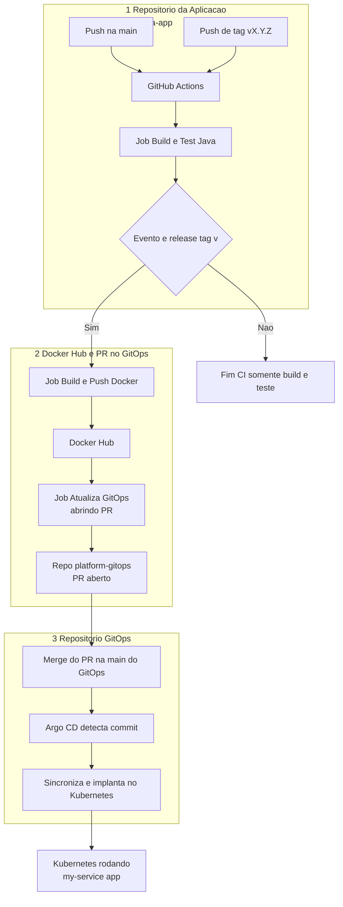

# Repositório GitOps: platform-gitops

Este repositório é a **única fonte da verdade** para o estado desejado do cluster Kubernetes deste projeto. Ele implementa a metodologia **GitOps**, onde o Argo CD monitora as alterações aqui e garante que o cluster reflita esse estado declarado.

---

## 🎯 Objetivo do Repositório

Gerenciar a implantação e configuração de todas as aplicações e infraestrutura de suporte no cluster Kubernetes (K3s) para os ambientes de `dev` e `prod` (embora neste projeto focamos em `dev`).

---

## 🗺️ Arquitetura de CI/CD e GitOps (Fluxograma Detalhado)

Este diagrama ilustra como o código da sua aplicação (`my-java-app`) é transformado em uma implantação no Kubernetes, passando pelo pipeline de CI/CD e pelo fluxo GitOps.


---

## 🚀 Estrutura do Repositório

Este repositório é organizado para segregar as definições de `Application` do Argo CD, as configurações de aplicações customizadas e as configurações de infraestrutura.

```
platform-gitops/
├── argocd/             # Definições das Argo CD Applications
│   ├── dev/            # Aplicações para o ambiente de desenvolvimento
│   │   ├── apps.yaml           # Argo CD Application para 'my-service' (exemplo de app customizada)
│   │   ├── grafana.yaml        # Argo CD Application para Grafana (Helm Chart remoto)
│   │   ├── postgres.yaml       # Argo CD Application para PostgreSQL (Helm Chart remoto)
│   │   ├── vmagent.yaml        # Argo CD Application para VMAgent (Helm Chart remoto)
│   │   └── vmsingle.yaml       # Argo CD Application para VMSingle (Helm Chart remoto)
│   └── prod/           # Aplicações para o ambiente de produção
│       ├── apps.yaml
│       └── ...
├── apps/               # Manifestos Kubernetes para aplicações customizadas (via Kustomize)
│   └── my-service/
│       ├── base/               # Manifestos base, agnósticos de ambiente
│       │   ├── deployment.yaml
│       │   ├── service.yaml
│       │   └── kustomization.yaml
│       └── overlays/
│           ├── dev/            # Overlays específicos para o ambiente de dev
│           │   ├── patch-replicas.yaml
│           │   └── kustomization.yaml
│           └── prod/           # Overlays específicos para o ambiente de prod
│               ├── patch-replicas.yaml
│               └── kustomization.yaml
└── infra/              # Configurações para serviços de infraestrutura (via Helm values)
    ├── grafana/
    │   └── dev/
    │       └── values.yaml     # Valores de customização para o Helm Chart do Grafana
    ├── postgres/
    │   ├── dev/
    │   │   └── values.yaml     # Valores de customização para o Helm Chart do postgres
    │   └── prod/
    │       └── values.yaml
    └── victoria-metrics/
        └── dev/
            ├── vmagent-values.yaml
            └── vmsingle-values.yaml

```

---

## 🧠 Como os Componentes Funcionam Juntos

### 0. Bootstrap Inicial do Cluster com Ansible

Antes que o Argo CD possa operar, ele precisa ser instalado no cluster K3s. Temos um playbook que cuida disso:
1.  Instala o K3s na sua VM remota.
2.  Instala o Argo CD no cluster K3s.
3.  **Cria a `Application` raiz do Argo CD (`root-gitops-app`)** no cluster. Esta `Application` aponta para a pasta `argocd/dev` (ou `prod`) deste repositório GitOps.
    *   **Integração:** O `root-gitops-app` é a "App of Apps". Ele monitora os arquivos `.yaml` dentro de `argocd/dev` (como `grafana.yaml`, `postgres.yaml`, etc.) e cria/gerencia essas `Applications` no Argo CD.

### 1. `argocd/` — Definições de Argo CD Application

Cada arquivo `.yaml` dentro de `argocd/dev` (e `prod`) representa uma `Application` que o Argo CD gerencia.

*   **`apps.yaml` (Exemplo para `my-service-dev`):**
    *   **Fonte:** Aponta para a pasta Kustomize (`apps/my-service/overlays/dev`) dentro deste mesmo repositório GitOps.
    *   **Tipo:** Kustomize.
    *   **Propósito:** Gerencia a implantação da sua aplicação customizada `my-service`.

*   **`grafana.yaml`, `postgres.yaml`, `vmagent.yaml`, `vmsingle.yaml` (Exemplos para Infraestrutura):**
    *   **Fonte (Multi-Source):** Estes usam uma configuração de `sources` que é crucial:
        *   **Fonte 1:** Aponta para o repositório GitOps (`https://github.com/ojasonw/platform-gitops.git`) para buscar o arquivo `values.yaml` específico do ambiente (ex: `infra/grafana/dev/values.yaml`).
        *   **Fonte 2:** Aponta para o repositório **remoto** do Helm Chart oficial de cada aplicação.
    *   **Tipo:** Helm.
    *   **Propósito:** Instalar e configurar ferramentas de infraestrutura (ex: Grafana, PostgreSQL) usando seus Charts Helm oficiais, mas com customizações definidas localmente no seu repositório GitOps.

### 2. `apps/` — Aplicações Customizadas (Kustomize)

Aqui você define o deploy das suas próprias aplicações.

*   **`apps/my-service/base/`**: Contém os manifestos Kubernetes genéricos (`deployment.yaml`, `service.yaml`) para a aplicação `my-service`. Estes manifestos não contêm informações específicas de ambiente.
*   **`apps/my-service/overlays/dev/`**: Contém arquivos que modificam (patcheiam) os manifestos da pasta `base` especificamente para o ambiente de `dev`.
    *   `kustomization.yaml`: Orquestra o Kustomize, dizendo para ele usar a `base` e aplicar os patches locais.
    *   `patch-replicas.yaml`: Um patch que, por exemplo, reduz o número de réplicas do `my-service` para 1 no ambiente de `dev`.

### 3. `infra/` — Serviços de Infraestrutura (Helm Values)

Nesta seção, você armazena os arquivos `values.yaml` que customizam os Helm Charts de serviços de terceiros.

*   **`infra/grafana/dev/values.yaml`**: Sobrescreve as configurações padrão do Chart do Grafana para o ambiente de `dev` (ex: configurações de Ingress, datasources, admin password).
*   **`infra/postgres/dev/values.yaml`**: Sobrescreve as configurações do Chart do PostgreSQL para `dev` (ex: versão da imagem, persistência).
*   **`infra/victoria-metrics/dev/*.yaml`**: Arquivos de valores para o VMSingle e VMAgent, customizando suas instalações.

---

## 🔄 Fluxo de Atualização de Aplicações via CI/CD (Ex: `my-java-app`)

Este é o ciclo completo que une o repositório da sua aplicação com este repositório GitOps:

1.  **Código da Aplicação (`my-java-app`):**
    *   Você desenvolve o código Java, faz commit e push para a branch `main`.
    *   Quando um **release** é preparado, você **cria e envia uma tag Git** (ex: `git tag v1.0.0`, `git push origin v1.0.0`).

2.  **GitHub Actions (`my-java-app`):**
    *   A Action é disparada pelo push da tag `v1.0.0`.
    *   O job `build_and_test` compila e testa seu código.
    *   O job `build_and_push_docker` constrói a imagem Docker (ex: `ojasonw/my-java-app:v1.0.0`) e a envia para o Docker Hub.

3.  **Atualização GitOps (neste repositório `platform-gitops`):**
    *   O job `update_gitops_repo` da Action do `my-java-app` faz o checkout deste repositório (`platform-gitops`).
    *   Ele usa `sed` para atualizar o arquivo `apps/my-service/overlays/dev/kustomization.yaml`, alterando `newTag: ...` para `newTag: v1.0.0`.
    *   Cria um commit com essa alteração e abre um **Pull Request** para a branch `main` deste repositório.

4.  **Implantação Automática com Argo CD:**
    *   Uma vez que o Pull Request é revisado e **mesclado** na branch `main` do `platform-gitops`.
    *   O **Argo CD** (que está monitorando este repositório) detecta o novo commit.
    *   Ele sincroniza a `Application my-service-dev`, que usa Kustomize, e implanta a nova versão da sua aplicação (`my-java-app:v1.0.0`) no cluster Kubernetes.

---
